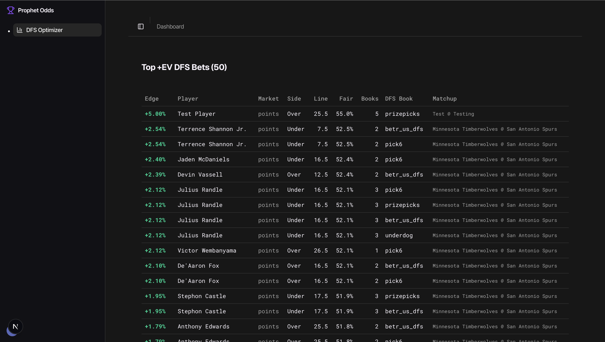

# Prophet Odds

**Real-time +EV DFS picks from sportsbook consensus.**

Prophet Odds finds mispriced player props on DFS apps (PrizePicks, Underdog, Betr, DraftKings Pick6) by comparing them to de-vigged sportsbook consensus. When a DFS line implies ~50% and sharp books say the true probability is meaningfully higher, that gap is edge — and the product surfaces it live for subscribers.

Built as a solo SaaS: Python pricing engine + scheduler, Next.js app with Clerk auth, Stripe subscriptions, and Supabase (Postgres + Realtime + RLS) as the system of record.

<!-- Live demo: TODO — add production URL when deployed -->
<!-- Screenshot: TODO — add docs/dashboard.png after capturing the live dashboard -->



[](https://www.python.org/)
[](https://go.dev/)
[](https://nextjs.org/)
[](https://www.typescriptlang.org/)
[](https://supabase.com/)
[](https://stripe.com/)
[](https://clerk.com/)

---

## What it does

**The problem.** DFS apps like PrizePicks often price player props near 50/50 (multiplier ≈ 1) regardless of true probability. Traditional sportsbooks price the same props with real odds that include a bookmaker margin (vig). When the DFS line and the sportsbook consensus disagree, one side is mispriced.

**How Prophet Odds solves it.** A Python scheduler continuously polls sportsbooks and DFS apps via The Odds API, de-vigs sportsbook lines into fair probabilities, builds a sharpness-weighted consensus, and ranks DFS picks by edge over the DFS breakeven (0.50). Ranked picks land in Supabase; the Next.js dashboard updates over Realtime for paying subscribers.

**Example.** PrizePicks offers “LeBron over 24.5 points” at a standard pick (implied ~50%). Sportsbook consensus after de-vigging says fair probability is 58%. Edge = 58% − 50% = **8%**. That pick is ranked and shown to subscribers.

---

## Architecture

```
                         ┌──────────────────────┐
                         │   The Odds API       │
                         │  (sportsbooks + DFS) │
                         └──────────┬───────────┘
                                    │
                                    ▼
                         ┌──────────────────────┐
                         │  Python scheduler    │
                         │  + pricing engine    │
                         └──────────┬───────────┘
                                    │ service role (bypass RLS)
                                    ▼
┌────────────┐           ┌──────────────────────┐           ┌────────────┐
│   Clerk    │──webhook─▶│      Supabase        │◀──webhook─│   Stripe   │
│  (users)   │           │  users               │           │ (billing)  │
└────────────┘           │  subscriptions       │           └────────────┘
                         │  invoices            │
                         │  ranked_bets         │
                         └──────────┬───────────┘
                                    │ Realtime + RLS
                                    │ (Clerk JWT → auth.jwt()->>'sub')
                                    ▼
                         ┌──────────────────────┐
                         │  Next.js 16 frontend │
                         │  marketing + app     │
                         └──────────────────────┘

Planned: Discord publisher (store/discord.py) → Discord webhook for alerts
```

| Path | Role |
|------|------|
| Odds API → Python → `ranked_bets` | Produce and upsert live +EV picks |
| Clerk webhook → `users` | Mirror identity for joins + RLS subject |
| Stripe webhook → `subscriptions` / `invoices` | Paywall state + billing history |
| Browser → Next.js → Supabase | Authenticated reads; RLS enforces subscription |

Deeper write-up: [`docs/architecture.md`](docs/architecture.md).

---

## Key technical decisions

| Decision | Why | Result |
|----------|-----|--------|
| **`OddsProvider` Protocol** | Business logic must not depend on The Odds API’s HTTP shape. | Swap to OpticOdds/Unabated ≈ one new provider file; scheduler and `engine/` stay untouched. |
| **Adaptive polling by game state** | Fixed 60s polling on all events burns credits at scale. | Cadence: 60s near/live, 5 min within 24h of tip; out of window → skip. Priority queue keyed by `next_poll`. |
| **De-vig + weighted consensus** | Raw prices include ~3–5% vig; soft books are noisy. | Fair probs from de-vigged lines; sharper books weighted higher in consensus. |
| **Pure functions in `engine/`** | Pricing bugs must be reproducible without network or DB. | `devig` / `consensus` / `edge` take data in, return data out — fixture-testable. |
| **Clerk JWT → Supabase RLS** | App-layer checks alone are not enough for a paywall. | Non-subscribers cannot `SELECT` `ranked_bets` even if the UI is wrong. |
| **Server actions vs API routes** | Webhooks are external; UI mutations are internal. | `checkout` / billing portal as server actions; Clerk/Stripe ingress as route handlers. |
| **Python prototype → Go later** | Iterate on math and scheduling first; optimize runtime second. | Python for design velocity; Go planned for 24/7 multi-sport polling. |

ADR-style notes: [`docs/decisions.md`](docs/decisions.md).

---

## Data flow

One complete cycle for an NBA slate:

1. **Discover** — Scheduler calls `/events` (low/no credit cost) for enabled sports.
2. **Window check** — Each event gets a cadence from commence time; out-of-window events are not polled.
3. **Fetch odds** — For due events, pull player props for sportsbook + DFS regions.
4. **Consensus** — De-vig each sportsbook book; weight by sharpness; produce fair probability per (player, market, line).
5. **Match DFS** — Keep DFS outcomes at multiplier ≈ 1 (standard picks); pair with consensus.
6. **Edge** — `edge = fair_prob - 0.50` (DFS breakeven).
7. **Persist** — Upsert into `ranked_bets` on unique `(player, market, line, side, dfs_book)`.
8. **Deliver** — Frontend Realtime channel updates the dashboard; RLS only returns rows to active/trialing subscribers.

---

## Tech stack

- **Python 3.11** — Scheduler + pricing engine prototype
- **Next.js 16 + React 19** — App Router, marketing + authenticated app route groups
- **TypeScript** — Compile-time contracts across UI, server actions, webhooks
- **Supabase (Postgres)** — Tables, Realtime on `ranked_bets`, RLS paywall
- **Clerk** — Auth, UserButton/Billing UI hooks, JWT for Supabase third-party auth
- **Stripe** — Checkout, Customer Portal, subscription + invoice webhooks
- **shadcn/ui + Tailwind CSS** — UI primitives and styling
- **The Odds API** — Sportsbook + DFS odds (v4 client in `oddsprovider/`)
- **Planned: Go + Railway/Fly.io** — Production scheduler runtime

---

## Repository structure

```
prophet/
├── backend/
│   └── python-prototype/          # Scheduler + pricing engine
│       ├── oddsprovider/          # OddsProvider Protocol + OddsAPI client
│       ├── engine/                # Pure math: devig, consensus, edge
│       ├── scheduler/             # Priority queue, cadence, thread pool
│       ├── markets/               # Per-sport market lists
│       ├── store/                 # Supabase writer, Discord publisher
│       └── main.py                # Entry point
├── frontend/                      # Next.js 16 SaaS app
│   ├── app/
│   │   ├── (marketing)/           # Public home + pricing (navbar)
│   │   ├── (app)/                 # Dashboard (sidebar, auth-gated)
│   │   └── api/webhooks/          # Clerk + Stripe handlers
│   ├── components/                # RankedBets, BillingPanel, PricingCard, …
│   └── lib/                       # Supabase, Stripe, server actions
├── docs/
│   ├── architecture.md            # Adaptive scheduler deep dive
│   ├── decisions.md               # ADRs
│   ├── schema.sql                 # Full Supabase schema + RLS
│   └── dashboard.png              # (add screenshot)
└── README.md
```

---

## Local development

**Prerequisites:** Node 20+, Python 3.11+, Supabase project, Clerk application, Stripe test mode account, The Odds API key.

### Backend

```bash
cd backend/python-prototype
python3 -m venv .venv
source .venv/bin/activate   # Windows: .venv\Scripts\activate
pip install -r requirements.txt
cp .env.example .env        # fill in keys (see below)
python main.py
```

### Frontend

```bash
cd frontend
npm install
cp .env.example .env.local  # fill in keys (see below)
npm run dev
```

App: [http://localhost:3000](http://localhost:3000)

For Stripe webhooks locally:

```bash
stripe listen --forward-to localhost:3000/api/webhooks/stripe
```

Use the printed `whsec_…` as `STRIPE_WEBHOOK_SECRET`. Point Clerk webhooks at a tunnel (e.g. ngrok) to `/api/webhooks/clerk` when testing signup sync.

---

## Environment variables

| Variable | Service | Scope |
|----------|---------|-------|
| `NEXT_PUBLIC_SUPABASE_URL` | Supabase | Public |
| `NEXT_PUBLIC_SUPABASE_ANON_KEY` | Supabase | Public |
| `SUPABASE_SERVICE_ROLE_KEY` | Supabase | Server only |
| `SUPABASE_URL` | Supabase (Python) | Server only |
| `ODDS_API_KEY` | The Odds API | Server only (Python) |
| `NEXT_PUBLIC_CLERK_PUBLISHABLE_KEY` | Clerk | Public |
| `CLERK_SECRET_KEY` | Clerk | Server only |
| `CLERK_WEBHOOK_SIGNING_SECRET` | Clerk | Server only |
| `NEXT_PUBLIC_STRIPE_PUBLISHABLE_KEY` | Stripe | Public |
| `STRIPE_SECRET_KEY` | Stripe | Server only |
| `STRIPE_PRICE_ID` | Stripe | Server only |
| `STRIPE_WEBHOOK_SECRET` | Stripe | Server only |
| `NEXT_PUBLIC_APP_URL` | Self | Public |

Enable the **Stripe Customer Portal** in the Stripe Dashboard so “Manage subscription” in the Clerk Billing tab can cancel, update cards, and switch plans.

Configure **Clerk as a third-party auth provider** in Supabase so `auth.jwt() ->> 'sub'` matches Clerk user IDs in RLS.

---

## Database schema

Four tables. Full DDL, indexes, RLS, and Realtime publication: [`docs/schema.sql`](docs/schema.sql).

```
users (id = Clerk user_…)
  └── subscriptions (1:1, status drives paywall)
  └── invoices (1:N, amounts in cents)

ranked_bets  ← written by Python (service role)
             ← read by frontend (authenticated + RLS)
```

**RLS (summary):**

- `users` / `subscriptions` / `invoices` — select own rows (`user_id` / `id` = JWT `sub`)
- `ranked_bets` — select only if an `active` or `trialing` subscription exists and `current_period_end` is null or in the future

Realtime is enabled on `ranked_bets` for live dashboard updates.

---

## Roadmap

### Done

- Pricing engine (de-vig, consensus, edge)
- Adaptive scheduler (priority queue + cadence)
- Clerk auth + user webhook → `users`
- Stripe Checkout, Customer Portal, webhooks → `subscriptions` / `invoices`
- Clerk UserButton **Billing** tab (plan, invoices, portal, subscribe)
- Real-time dashboard with RLS paywall
- Marketing + app route groups (Next.js)

### In progress

- Expand beyond NBA
- Deploy scheduler (Railway / Fly)

### Planned

- Go production scheduler
- Discord OAuth + auto role-sync for subscribers
- Historical backtesting
- Alternate DFS markets (e.g. PrizePicks demons/goblins)

---

## License

[MIT](LICENSE)
